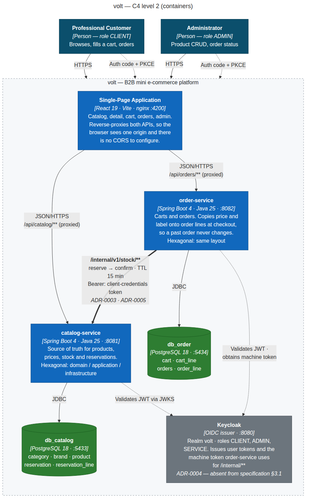
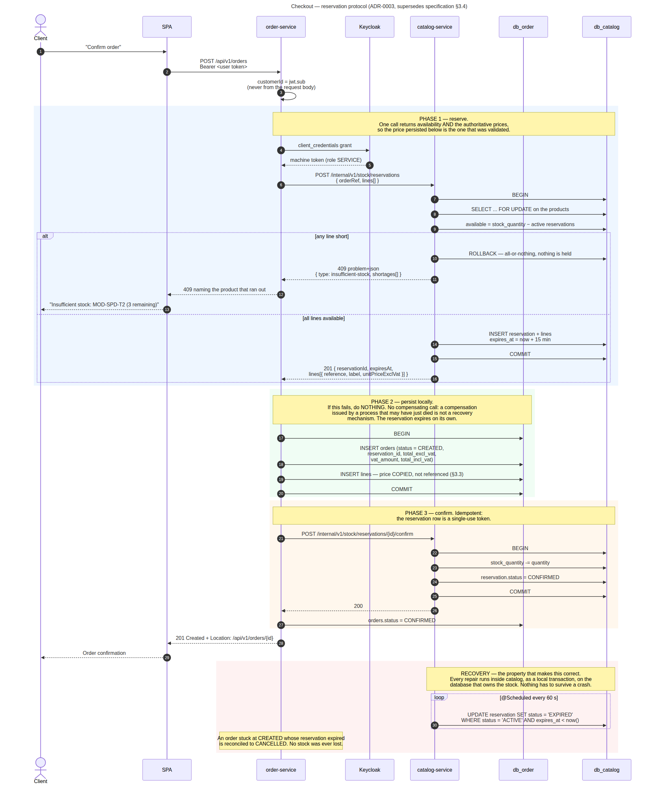

# Volt

Two Spring Boot microservices in hexagonal architecture, a React SPA, PostgreSQL
per service, Keycloak for identity, all orchestrated with Docker Compose.

The point of the project is the quality of the design rather than the breadth of
the features: service decomposition, ports and adapters, inter-service
consistency, testing, containerisation and CI.

## Quick start

```bash
cp .env.example .env          # edit the passwords if you like
docker compose up --build
```

| | URL |
|---|---|
| SPA | <http://localhost:5173> |
| catalog-service — Swagger | <http://localhost:8081/swagger-ui.html> |
| order-service — Swagger | <http://localhost:8082/swagger-ui.html> |
| Keycloak admin console | <http://localhost:8080> |

First start takes a few minutes: Maven downloads dependencies inside the build
stage and Keycloak imports its realm. Subsequent starts are fast.

### Test accounts

| Username | Password | Roles |
|---|---|---|
| `client@volt.test` | `client` | `CLIENT` |
| `admin@volt.test` | `admin` | `ADMIN`, `CLIENT` |

The Keycloak admin console uses `KEYCLOAK_ADMIN` / `KEYCLOAK_ADMIN_PASSWORD`
from `.env`.

The catalog is seeded with 51 products across 5 categories. Two references are
deactivated so the soft delete is visible, and `MOD-SPD-T2` is left with 3
units so the insufficient-stock path can be demonstrated without emptying the
warehouse first.

## Architecture



Two services, one database each, no service reads the other's database. The SPA
is served by nginx, which also reverse-proxies both APIs, so the browser talks to
a single origin and there is no CORS configuration in either service.

The checkout is the interesting part:



### Decisions

Every load-bearing choice is recorded in [`docs/adr/`](docs/adr/), with the
alternatives that were rejected and what each decision costs later.

| ADR | Decision |
|---|---|
| [0001](docs/adr/0001-hexagonal-package-layout.md) | Hexagonal layout, enforced by ArchUnit rather than by discipline |
| [0002](docs/adr/0002-service-boundaries.md) | Boundaries drawn by data ownership; database per service |
| [0003](docs/adr/0003-stock-consistency.md) | **Stock: reserve → confirm with TTL expiry** |
| [0004](docs/adr/0004-authentication.md) | Keycloak as OIDC issuer; both services are resource servers |
| [0005](docs/adr/0005-inter-service-communication.md) | Synchronous REST, split timeouts, idempotent endpoints |
| [0006](docs/adr/0006-persistence-and-migrations.md) | Flyway owns the schema everywhere, tests included |
| [0007](docs/adr/0007-frontend-framework.md) | React instead of Angular — **pending sign-off** |
| [0008](docs/adr/0008-lombok-and-jakarta-annotations.md) | Lombok and jakarta annotations, scoped by layer |

Three of these deviate from the technical specification. ADR-0003 and ADR-0004 correct
gaps in the specification; ADR-0007 is a preference and is not yet approved. All
three are argued in full in their respective records.

The most important one is ADR-0003. The specification's §3.4 says that if the stock
decrement fails, "the transaction is rolled back in order-service" — but a local
rollback in one service cannot undo a committed write in another service's
database. The specification also mandates a retry on a non-idempotent decrement,
which double-decrements after an ambiguous timeout. This project replaces that
with a reservation protocol whose recovery path runs inside the service that owns
the stock, so nothing has to survive a crash for the system to stay consistent.

## Repository layout

```
volt/
├── backend/
│   ├── pom.xml                 Maven aggregator for the two services
│   ├── catalog-service/        products, stock, reservations  (:8081)
│   └── order-service/          carts, orders                  (:8082)
├── frontend/                   React 19 + Vite SPA, served by nginx (:4200)
├── infra/keycloak/             realm export — treat as source code
├── docs/
│   ├── adr/                    architecture decision records
│   └── architecture/           C4 + sequence diagrams (.mmd, .svg, .png)
├── docker-compose.yml
└── .env.example
```

Each service follows the same package layout:

```
com.volt.<service>
├── domain/          model, exception, service     — no framework, at all
├── application/     port/in, port/out, usecase    — orchestration
└── infrastructure/
    ├── adapter/in/web/    controller, dto/request, dto/response, advice
    ├── adapter/out/persistence/  entity, repository, mapper + *PersistenceAdapter
    ├── adapter/out/client/       REST clients implementing out-ports
    └── config/                   security, clocks, bean wiring
```

Both adapters are split by role rather than left flat, and the split is
asserted by `HexagonalArchitectureTest` rather than merely agreed — `*Request`
in `dto/request`, `@Entity` in `entity`, `*JpaRepository` in `repository`, and
no path at all from the web adapter to a JPA entity. The sub-packages stay
inside `adapter/in/web` and `adapter/out/persistence` so every hexagonal rule,
which is written against those prefixes, still holds. See ADR-0001.

Entities are classes with identity-based equality; value objects are records.
Lombok supplies accessors and `toString` in the domain and nothing else —
`@Data`, `@Setter`, `@EqualsAndHashCode`, `@Value`, `@AllArgsConstructor` and
`@Builder` are rejected at compile time by `domain/lombok.config`. In
`infrastructure` all of Lombok is available, and that is also where
`jakarta.persistence` and `jakarta.validation` live. See ADR-0001 and ADR-0008.

Dependencies point inward only. `HexagonalArchitectureTest` in each service
enforces that, plus the rules that JPA stays inside the persistence adapter, that
ports are interfaces, and that controllers depend on in-port interfaces rather
than on use case implementations.

## API

Both services expose OpenAPI at `/swagger-ui.html`.

### catalog-service (8081)

| Method | Endpoint | Role |
|---|---|---|
| GET | `/api/v1/products?page=&size=&q=&categoryId=&brandId=` | public |
| GET | `/api/v1/products/{id}` | public |
| GET | `/api/v1/products?ids=1,2,3` | public |
| POST | `/api/v1/products` | ADMIN |
| PUT | `/api/v1/products/{id}` | ADMIN |
| DELETE | `/api/v1/products/{id}` — soft delete | ADMIN |
| GET | `/api/v1/categories`, `/api/v1/brands` | public |
| POST | `/internal/v1/stock/reservations` | SERVICE |
| POST | `/internal/v1/stock/reservations/{id}/confirm` | SERVICE |
| DELETE | `/internal/v1/stock/reservations/{id}` | SERVICE |
| POST | `/internal/v1/stock/restock` | SERVICE |

`/internal/**` requires the `SERVICE` role, which only order-service's
client-credentials token carries. It is not reachable from a browser and is not
proxied by the frontend's nginx.

### order-service (8082)

| Method | Endpoint | Role |
|---|---|---|
| GET | `/api/v1/cart` | CLIENT |
| POST | `/api/v1/cart/lines` | CLIENT |
| PUT | `/api/v1/cart/lines/{id}` | CLIENT |
| DELETE | `/api/v1/cart/lines/{id}` | CLIENT |
| POST | `/api/v1/orders` | CLIENT |
| GET | `/api/v1/orders`, `/api/v1/orders/{id}` | CLIENT |
| PATCH | `/api/v1/orders/{id}/status` | ADMIN |

Errors are RFC 7807 `application/problem+json` with stable `type` URIs. A stock
conflict returns 409 with a `shortages` array naming each product that ran short.

## Development

**Opening the project.** `backend/pom.xml` is a Maven aggregator, so point
IntelliJ at `backend/pom.xml` (Open → select the file → "Open as Project", or
right-click → Add as Maven Project if `~/volt` is already open). Both services
then import as modules with their source roots set correctly. Without it the IDE
treats the repository as a plain folder with no source roots and reports "Java
file is located outside of the module source root".

**Lombok needs an IDE plugin.** IntelliJ bundles it; enable annotation
processing (Settings → Build → Compiler → Annotation Processors). Without it
the IDE reports missing getters on code that compiles perfectly from Maven.

```bash
# databases and Keycloak only, services run from your IDE
docker compose up postgres-catalog postgres-order keycloak

cd backend/catalog-service && ./mvnw spring-boot:run
cd backend/order-service   && ./mvnw spring-boot:run
cd frontend                && npm run dev        # :5173, registered in the realm

# tests
cd backend/catalog-service && ./mvnw verify      # needs a Docker daemon
cd frontend                && npm run test
```

Tests use Testcontainers, so no local PostgreSQL install is required — but a
running Docker daemon is.

The schema is built by Flyway in every profile including tests, and
`ddl-auto` is `validate` everywhere. An entity that has drifted from its
migration fails at startup with a precise message instead of at the first query
that touches the column.

## Conventions

- Branches `main` and `feature/xxx`; no direct commits to `main`.
- [Conventional Commits](https://www.conventionalcommits.org): `feat:`, `fix:`,
  `refactor:`, `test:`, `docs:`, `chore:`.
- Every feature goes through a pull request. CI must be green to merge.
- Database, Java, HTTP, and JSON identifiers use one consistent English
  vocabulary. JPA annotations remain explicit so schema drift is visible.
- Money is `NUMERIC(10,2)` → `BigDecimal`. Timestamps are `TIMESTAMPTZ` →
  `Instant`. No exceptions to either.

## Frontend

The SPA covers the six screens the specification asks for, and each is a real
address — bookmarkable, shareable, and correct under the back button.

| Screen | Route | Access |
|---|---|---|
| Catalog — grid, search, category/brand filters, pagination | `/` | public |
| Product detail — specifications, price excl. VAT, stock, add to cart | `/products/:id` | public |
| Cart — editable lines, totals excl./VAT/incl. | `/cart` | `CLIENT` |
| Orders — history and detail | `/orders`, `/orders/:id` | `CLIENT` |
| Administration — product create, edit, withdraw | `/admin` | `ADMIN` |
| Sign in | Keycloak redirect | — |

Sign-in is Authorization Code + PKCE against Keycloak, written by hand rather
than via `keycloak-js` (ADR-0004). The session renews itself before expiry, and
a 401 that slips through is refreshed and replayed once, so an expiring token
never reaches the screen. Filter and search state lives in the query string, so
a filtered catalog is a link you can send someone.

The code is organised in feature slices with the dependency direction
`app → pages → features → shared` **enforced by lint rules**, in the same spirit
as the backend's `HexagonalArchitectureTest`. See
[`frontend/README.md`](frontend/README.md) for the structure and the reasoning
behind it.

## Stack

| Layer | Technology |
|---|---|
| Backend | Java 25, Spring Boot 4.1, Maven |
| Persistence | PostgreSQL 18, Flyway, Spring Data JPA |
| Identity | Keycloak 26 (OIDC) |
| Frontend | React 19, React Router 8, Vite, TypeScript |
| Tests | JUnit, Mockito, AssertJ, Testcontainers, ArchUnit, Vitest |
| CI | GitHub Actions |
